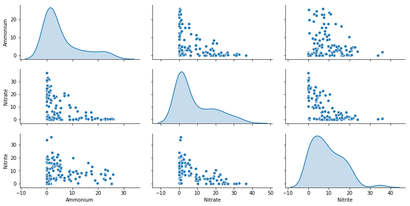
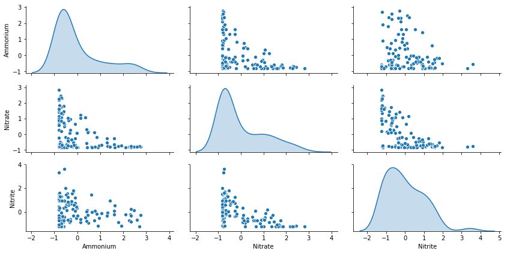
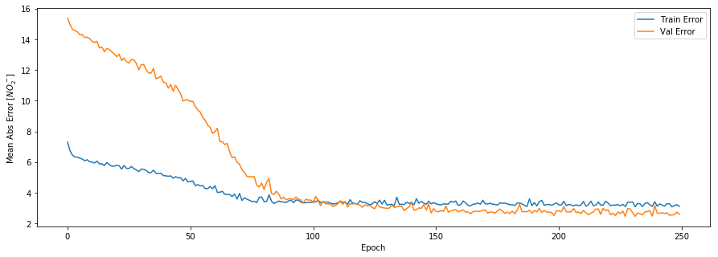
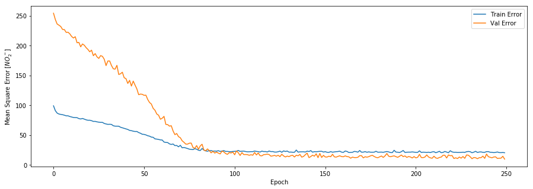
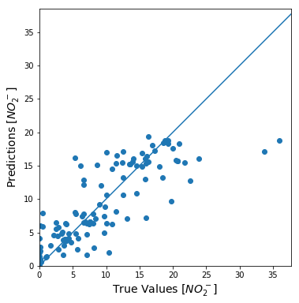
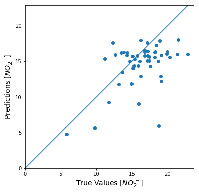
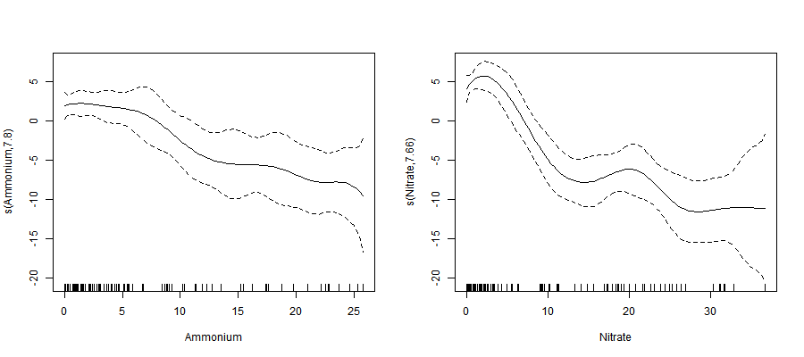
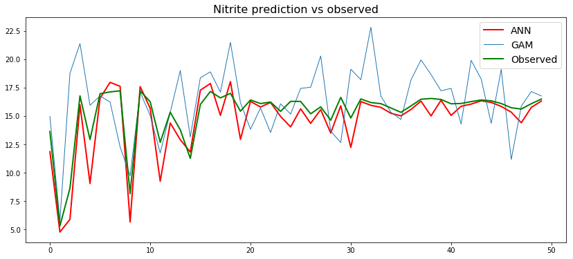

<h1>Prediction of Nitrite concentration using Artificial Neural Network and Generalized Additive Models</h1>

I have sensor data from my system which gives me concentrations of ammonium and nitrate, but I don't have a sensor to measure concentration of nitrite. I know the three nitrogen species are chemically related and their rates are dependent on each other, but not completely. However, since I have historical performance data from the same reactor, I am hoping this data will capture most of the variablilities. Thus, I would like to mine the data using machine learning techniques if it could give me a reasonable value for nitrite. Here, I have tried three different commonly used machine learning algorithms: multiple linear regression, artificial neural network and generalized additive models.

- [Import packages and load data](#sec1)
- [Multiple linear regeression](#sec2)
- [Artificial neural network using keras](#sec3)
- [Generalized additive models](#sec4)

## <a id='sec1'> </a> Import packages and load data


```python
import pandas as pd
import numpy as np
```


```python
data = pd.read_csv('sensor_n.csv', sep='\t')
```


```python
data.head()
```


<div>
<style scoped>
    .dataframe tbody tr th:only-of-type {
        vertical-align: middle;
    }

    .dataframe tbody tr th {
        vertical-align: top;
    }

    .dataframe thead th {
        text-align: right;
    }
</style>
<table border="1" class="dataframe">
  <thead>
    <tr style="text-align: right;">
      <th></th>
      <th>Ammonium</th>
      <th>Nitrate</th>
      <th>Nitrite</th>
    </tr>
  </thead>
  <tbody>
    <tr>
      <th>0</th>
      <td>1.55</td>
      <td>26.35</td>
      <td>0.00</td>
    </tr>
    <tr>
      <th>1</th>
      <td>4.61</td>
      <td>3.32</td>
      <td>6.61</td>
    </tr>
    <tr>
      <th>2</th>
      <td>15.44</td>
      <td>0.53</td>
      <td>8.43</td>
    </tr>
    <tr>
      <th>3</th>
      <td>25.78</td>
      <td>0.22</td>
      <td>7.12</td>
    </tr>
    <tr>
      <th>4</th>
      <td>17.36</td>
      <td>5.52</td>
      <td>9.65</td>
    </tr>
  </tbody>
</table>
</div>


```python
data.shape
```


    (120, 3)


```python
X = data[['Ammonium','Nitrate']]
y = data['Nitrite']
```


```python
X.shape
```


    (120, 2)


##  <a id='sec2'> </a> Let us trying fitting linear regression

Before we jump to using ANN, let us try fit a multiple linear regression model and see the performance. For this I will use the `statsmodels` api the `OLS` (ordinary least regresion) function.


```python
import statsmodels.api as sm
```


```python
X_lm = sm.add_constant(X)
model = sm.OLS(y, X_lm).fit()
train_predict_lm = model.predict()
model.summary()
```


<table class="simpletable">
<caption>OLS Regression Results</caption>
<tr>
  <th>Dep. Variable:</th>         <td>Nitrite</td>     <th>  R-squared:         </th> <td>   0.562</td>
</tr>
<tr>
  <th>Model:</th>                   <td>OLS</td>       <th>  Adj. R-squared:    </th> <td>   0.555</td>
</tr>
<tr>
  <th>Method:</th>             <td>Least Squares</td>  <th>  F-statistic:       </th> <td>   75.14</td>
</tr>
<tr>
  <th>Date:</th>             <td>Fri, 10 May 2019</td> <th>  Prob (F-statistic):</th> <td>1.03e-21</td>
</tr>
<tr>
  <th>Time:</th>                 <td>19:37:33</td>     <th>  Log-Likelihood:    </th> <td> -361.21</td>
</tr>
<tr>
  <th>No. Observations:</th>      <td>   120</td>      <th>  AIC:               </th> <td>   728.4</td>
</tr>
<tr>
  <th>Df Residuals:</th>          <td>   117</td>      <th>  BIC:               </th> <td>   736.8</td>
</tr>
<tr>
  <th>Df Model:</th>              <td>     2</td>      <th>                     </th>     <td> </td>   
</tr>
<tr>
  <th>Covariance Type:</th>      <td>nonrobust</td>    <th>                     </th>     <td> </td>   
</tr>
</table>
<table class="simpletable">
<tr>
      <td></td>        <th>coef</th>     <th>std err</th>      <th>t</th>      <th>P>|t|</th>  <th>[0.025</th>    <th>0.975]</th>  
</tr>
<tr>
  <th>const</th>    <td>   16.9006</td> <td>    0.815</td> <td>   20.746</td> <td> 0.000</td> <td>   15.287</td> <td>   18.514</td>
</tr>
<tr>
  <th>Ammonium</th> <td>   -0.4815</td> <td>    0.069</td> <td>   -7.019</td> <td> 0.000</td> <td>   -0.617</td> <td>   -0.346</td>
</tr>
<tr>
  <th>Nitrate</th>  <td>   -0.5961</td> <td>    0.050</td> <td>  -12.026</td> <td> 0.000</td> <td>   -0.694</td> <td>   -0.498</td>
</tr>
</table>
<table class="simpletable">
<tr>
  <th>Omnibus:</th>       <td>18.466</td> <th>  Durbin-Watson:     </th> <td>   1.107</td>
</tr>
<tr>
  <th>Prob(Omnibus):</th> <td> 0.000</td> <th>  Jarque-Bera (JB):  </th> <td>  35.915</td>
</tr>
<tr>
  <th>Skew:</th>          <td> 0.635</td> <th>  Prob(JB):          </th> <td>1.59e-08</td>
</tr>
<tr>
  <th>Kurtosis:</th>      <td> 5.360</td> <th>  Cond. No.          </th> <td>    23.7</td>
</tr>
</table><br/><br/>Warnings:<br/>[1] Standard Errors assume that the covariance matrix of the errors is correctly specified.


```python
np.corrcoef(train_predict_lm, y)[0,1]
```


    0.7498325656120826


### Import test data


```python
test_data = pd.read_csv('nitrite_test.csv', sep='\t')
X_test = test_data[['Ammonium','Nitrate']]
y_test = test_data['Nitrite']
```

### Linear model prediction on test  data


```python
X.shape
```


    (120, 2)


```python
X_test_sm = sm.add_constant(X_test)
lm_test_predict = model.predict(X_test_sm)
np.corrcoef(lm_test_predict, y_test)[0,1]
```

    c:\users\zerua\appdata\local\conda\conda\envs\py36_64\lib\site-packages\numpy\core\fromnumeric.py:2389: FutureWarning: Method .ptp is deprecated and will be removed in a future version. Use numpy.ptp instead.
      return ptp(axis=axis, out=out, **kwargs)
    


    0.42503757496134137


Using multiple linear regression result an Ok model, but it is not good enough. Thus a linear relationship did not fit well for this model. Next, I will try using ANN using the `keras` package.

## <a id='sec3'> </a>  ANN model using the Keras API


```python
import tensorflow as tf
```


```python
from tensorflow import keras

print(tf.VERSION)
print(keras.__version__)
```

    1.13.0-rc2
    2.2.4-tf
    

Let us plot a pairplot to see the distribution of the feature variables.


```python
import seaborn as sns
sns.pairplot(data, diag_kind="kde", height=2, aspect=2)
```


    <seaborn.axisgrid.PairGrid at 0x2bc8b009cf8>





Before we build the ANN model we need to standardize our data to avoid the effect of unit and magnitude difference in the feature variables.


```python
data_mean = data.mean()
data_std = data.std()
norm_data = (data-data_mean)/data_std
norm_data.describe()
```


<div>
<style scoped>
    .dataframe tbody tr th:only-of-type {
        vertical-align: middle;
    }

    .dataframe tbody tr th {
        vertical-align: top;
    }

    .dataframe thead th {
        text-align: right;
    }
</style>
<table border="1" class="dataframe">
  <thead>
    <tr style="text-align: right;">
      <th></th>
      <th>Ammonium</th>
      <th>Nitrate</th>
      <th>Nitrite</th>
    </tr>
  </thead>
  <tbody>
    <tr>
      <th>count</th>
      <td>1.200000e+02</td>
      <td>1.200000e+02</td>
      <td>1.200000e+02</td>
    </tr>
    <tr>
      <th>mean</th>
      <td>2.590520e-16</td>
      <td>-1.776357e-16</td>
      <td>-2.590520e-16</td>
    </tr>
    <tr>
      <th>std</th>
      <td>1.000000e+00</td>
      <td>1.000000e+00</td>
      <td>1.000000e+00</td>
    </tr>
    <tr>
      <th>min</th>
      <td>-7.972429e-01</td>
      <td>-8.249187e-01</td>
      <td>-1.231318e+00</td>
    </tr>
    <tr>
      <th>25%</th>
      <td>-7.355950e-01</td>
      <td>-7.933110e-01</td>
      <td>-7.565472e-01</td>
    </tr>
    <tr>
      <th>50%</th>
      <td>-4.301112e-01</td>
      <td>-5.456761e-01</td>
      <td>-2.126573e-01</td>
    </tr>
    <tr>
      <th>75%</th>
      <td>4.181490e-01</td>
      <td>6.728368e-01</td>
      <td>7.184313e-01</td>
    </tr>
    <tr>
      <th>max</th>
      <td>2.754222e+00</td>
      <td>2.822656e+00</td>
      <td>3.586855e+00</td>
    </tr>
  </tbody>
</table>
</div>


```python
sns.pairplot(norm_data, diag_kind="kde", height=2, aspect=2)
```


    <seaborn.axisgrid.PairGrid at 0x2bc8d57e8d0>





Next, I will build the ANN model which has three hidden layers and an output layer with one perceptron. The choice of the ANN model architecture at this point is arbitrary, but we can try later different model architecture to improve the model's performance.


```python
#from keras.layers import Dense
from tensorflow.keras import layers
import numpy as np
    
def build_model():
    model = keras.Sequential([
        layers.Dense(64, activation=tf.nn.relu, input_shape=(2,)),
        layers.Dense(64, activation=tf.nn.relu),
        layers.Dense(32, activation=tf.nn.relu),
        layers.Dense(1)
  ])

    optimizer = tf.keras.optimizers.RMSprop(lr=0.001)

    model.compile(loss='mean_squared_error',
                optimizer=optimizer,
                metrics=['mean_absolute_error'])
    return model
```


```python
model=build_model()
```


```python
model.summary()
```

    _________________________________________________________________
    Layer (type)                 Output Shape              Param #   
    =================================================================
    dense_48 (Dense)             (None, 64)                192       
    _________________________________________________________________
    dense_49 (Dense)             (None, 64)                4160      
    _________________________________________________________________
    dense_50 (Dense)             (None, 32)                2080      
    _________________________________________________________________
    dense_51 (Dense)             (None, 1)                 33        
    =================================================================
    Total params: 6,465
    Trainable params: 6,465
    Non-trainable params: 0
    _________________________________________________________________
    

Next, we will fit/train the model as show below using the `model.fit` function.


```python
EPOCHS = 250 # Number of iterations

history = model.fit( X, y, epochs=EPOCHS, validation_split = 0.2, verbose=0)
```


```python
hist = pd.DataFrame(history.history)
hist['epoch'] = history.epoch
hist.tail()
```


<div>
<style scoped>
    .dataframe tbody tr th:only-of-type {
        vertical-align: middle;
    }

    .dataframe tbody tr th {
        vertical-align: top;
    }

    .dataframe thead th {
        text-align: right;
    }
</style>
<table border="1" class="dataframe">
  <thead>
    <tr style="text-align: right;">
      <th></th>
      <th>loss</th>
      <th>mean_absolute_error</th>
      <th>val_loss</th>
      <th>val_mean_absolute_error</th>
      <th>epoch</th>
    </tr>
  </thead>
  <tbody>
    <tr>
      <th>245</th>
      <td>21.789733</td>
      <td>3.283959</td>
      <td>10.966087</td>
      <td>2.533762</td>
      <td>245</td>
    </tr>
    <tr>
      <th>246</th>
      <td>20.793131</td>
      <td>3.077481</td>
      <td>11.351815</td>
      <td>2.545471</td>
      <td>246</td>
    </tr>
    <tr>
      <th>247</th>
      <td>20.674088</td>
      <td>3.164247</td>
      <td>11.444407</td>
      <td>2.569648</td>
      <td>247</td>
    </tr>
    <tr>
      <th>248</th>
      <td>20.911383</td>
      <td>3.219277</td>
      <td>14.614449</td>
      <td>2.745522</td>
      <td>248</td>
    </tr>
    <tr>
      <th>249</th>
      <td>20.544966</td>
      <td>3.112924</td>
      <td>9.801442</td>
      <td>2.596714</td>
      <td>249</td>
    </tr>
  </tbody>
</table>
</div>


```python
import matplotlib.pyplot as plt
def plot_history(history):
    hist = pd.DataFrame(history.history)
    hist['epoch'] = history.epoch
  
    plt.figure(figsize=(15,5))
    plt.xlabel('Epoch')
    plt.ylabel('Mean Abs Error [$NO_2^-$]')
    plt.plot(hist['epoch'], hist['mean_absolute_error'], label='Train Error')
    plt.plot(hist['epoch'], hist['val_mean_absolute_error'], label = 'Val Error')
    
    #plt.ylim([0,5])
    plt.legend()

    plt.figure(figsize=(15,5))
    plt.xlabel('Epoch')
    plt.ylabel('Mean Square Error [$NO_2^-$]')
    plt.plot(hist['epoch'], hist['loss'],
             label='Train Error')
    plt.plot(hist['epoch'], hist['val_loss'],
             label = 'Val Error')
    #plt.ylim([0,20])
    plt.legend()

    plt.show()

plot_history(history)
```








```python
training_predictions = model.predict(X) #.flatten()
```


```python
#Check correlation coefficient of predicted vs observed 
import numpy as np
print(f'Pearson\'s correlation coefficient = {np.corrcoef(training_predictions.flatten(),y)[0,1]:.2f}')
```

    Pearson's correlation coefficient = 0.81
    


```python
plt.figure(figsize=(6,6))
plt.scatter(y, training_predictions)
plt.xlabel('True Values [$NO_2^-$]', fontsize=14)
plt.ylabel('Predictions [$NO_2^-$]', fontsize=14)
plt.axis('equal')
plt.axis('square')
plt.xlim([0,plt.xlim()[1]])
plt.ylim([0,plt.ylim()[1]])
_ = plt.plot([-100, 100], [-100, 100])
```





### Model prediction

Let us load the test data.


```python
loss, mae = model.evaluate(X_test, y_test, verbose=0)

print("Testing set Mean Abs Error: {:5.2f} Nitrite".format(mae))
print("Testing set Mean squared Error: {:5.2f} mg/L N-Nitrite".format(mse))

test_predictions = model.predict(X_test).flatten()
print(f'Pearson\'s correlation coefficient = {np.corrcoef(test_predictions.flatten(),y_test)[0,1]:.2f}')
```

    Testing set Mean Abs Error:  2.68 Nitrite
    Testing set Mean squared Error: 18.11 mg/L N-Nitrite
    Pearson's correlation coefficient = 0.47
    


```python
plt.figure(figsize=(6,6))
plt.scatter(y_test, test_predictions)
plt.xlabel('True Values [$NO_2^-$]', fontsize=14)
plt.ylabel('Predictions [$NO_2^-$]', fontsize=14)
plt.axis('equal')
plt.axis('square')
plt.xlim([0,plt.xlim()[1]])
plt.ylim([0,plt.ylim()[1]])
_ = plt.plot([0, 100], [0, 100])
```





##  <a id='sec4'> </a> Prediction using GAM

I am going to use R to do the generalized additive model (GAM). To use R from a python jupyter notebook, I am going to use the `rpy2` and `rmagic` packages together to call R functions. I can also reuse the variable betweeen R and python.


```python
import rpy2.rinterface
%load_ext rpy2.ipython
```


```r
%%R
# Install the mgcv package for GAM
install.packages('mgcv')
```


```r
%%R -i data -o mod_sum

library(mgcv)
model <- gam(Nitrite ~ s(Ammonium, bs='ps', sp=0.1)+s(Nitrate, bs='ps', sp=0.1), data = data)
summry(model)  #This prints to console
mod_sum <- summary(model)
```


```python
print(mod_sum)
```

    
    
    Family: gaussian 
    
    Link function: identity 
    
    
    
    Formula:
    
    Nitrite ~ s(Ammonium, bs = "ps", sp = 0.1) + s(Nitrate, bs = "ps", 
    
        sp = 0.1)
    
    
    
    Parametric coefficients:
    
                Estimate Std. Error t value Pr(>|t|)    
    
    (Intercept)    9.175      0.438   20.95   <2e-16 ***
    
    ---
    
    Signif. codes:  0 '***' 0.001 '**' 0.01 '*' 0.05 '.' 0.1 ' ' 1
    
    
    
    Approximate significance of smooth terms:
    
                  edf Ref.df      F  p-value    
    
    s(Ammonium) 7.798  8.368  6.146 9.23e-07 ***
    
    s(Nitrate)  7.661  8.118 19.147  < 2e-16 ***
    
    ---
    
    Signif. codes:  0 '***' 0.001 '**' 0.01 '*' 0.05 '.' 0.1 ' ' 1
    
    
    
    R-sq.(adj) =  0.585   Deviance explained = 63.9%
    
    GCV = 26.676  Scale est. = 23.017    n = 120
    
    


```r
%%R -w 900 -h 400

par(mfrow=c(1,2))
plot(model)
```





```r
%%R -i X_test -o no2_gam

#x_new = test_data[,c('Ammonium','Nitrate')]
no2_gam <- predict(model, newdata=X_test)
```


```python
# Read from r GAM output
import numpy as np

no2_gam_r = np.array(no2_gam)
```


```python
x_axis=range(0,len(test_predictions))
```


```python
np.corrcoef(y_test,no2_gam_r)[0,1]
```


    0.5187474131044831


```python
np.corrcoef(y_test,test_predictions)[0,1]
```


    0.4720899990732165


Next, let us plot and compare both ANN and GAM results as shown below.


```python
plt.figure(figsize=(14,6))
plt.plot(x_axis, test_predictions, 'r', linewidth=2, label='ANN')
plt.plot(x_axis, y_test, linewidth=1, label='GAM')
plt.plot(x_axis, no2_gam_r, 'g', linewidth=2, label = 'Observed')
plt.legend(fontsize=14)
plt.title('Nitrite prediction vs observed', fontsize=16)
```


    Text(0.5, 1.0, 'Nitrite prediction vs observed')





# Conclusion

As we saw in the above plot using ANN resulted in a much better looking prediction compared to GAM. However, both of them have an average correlation with the test data (Correlation for ANN = 0.47 and GAM = 0.51), which is not that different from the linear regression result. Hence, either the ANN model has to changed or other algorithm might need to be tested.
